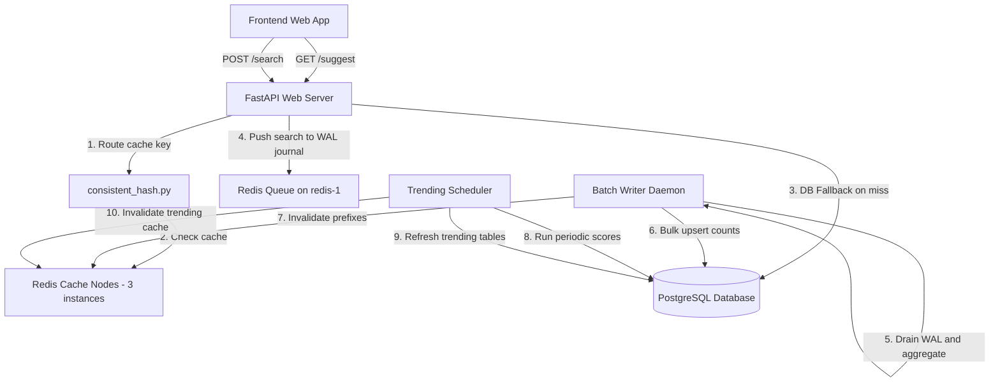

# High-Performance Distributed Search Typeahead System

A production-ready, highly concurrent, distributed autocomplete search suggestion engine built with **FastAPI**, **PostgreSQL**, and a cached routing layer using **Consistent Hashing** across 3 **Redis** nodes. The system is designed to handle heavy lookup traffic with sub-5ms cached latencies, protect primary database I/O limits using an asynchronous **Redis-backed Write-Ahead Log (WAL) Batch Ingestor**, and compute real-time trends using a **Recency-Aware Ranking Algorithm**.

---

## 1. System Architecture

The following diagram illustrates the components, background workers, and request pathways of the typeahead system:



---

## 2. Project Features

*   **Distributed Caching with Consistent Hashing**: Auto-routes lookup prefixes to one of three independent Redis nodes using a consistent hash ring with 200 virtual nodes per physical instance to ensure uniform key distribution.
*   **Asynchronous WAL Batch Ingestor**: Prevents database transaction exhaustion under heavy search volume. Incoming searches are buffered into a crash-resilient Redis List queue (Write-Ahead Log), aggregated in memory by a background worker, and flushed to PostgreSQL in bulk updates.
*   **Recency-Aware Trending Engine**: Computes search trends using a weighted score combining total search popularity ($\alpha = 0.2$) with recent activity logs from the last 2 hours ($\beta = 0.8 \times 10$). A background daemon precalculates scores to keep suggest routes blazing fast.
*   **Fault-Tolerant Circuit Breakers**: Standardizes connections to cache instances. If any Redis container experiences an outage, its designated circuit breaker trips open, routing requests directly to the DB fallback to avoid cascading timeouts.
*   **Premium Autocomplete Frontend**: A responsive, modern glassmorphic interface supporting debounced inputs (300ms), client-side session caching, keyboard arrow/enter navigation, and matching prefix highlighting.

---

## 3. Directory Structure

```text
├── Makefile                   # Convenient shortcuts for docker, ingestion, and tests
├── docker-compose.yml         # Defines app, database, and 3 Redis containers
├── .env                       # Environment variables config file
├── .env.example               # Example template for configs
├── backend/
│   ├── Dockerfile             # Multi-stage image build for FastAPI web app
│   ├── requirements.txt       # App requirements (FastAPI, SQLAlchemy, Redis, etc.)
│   ├── app/
│   │   ├── __init__.py
│   │   ├── main.py            # FastAPI main entry points and metrics tracking
│   │   ├── models.py          # SQLAlchemy models (SearchQuery, QueryTrending, SearchActivity)
│   │   ├── database.py        # Relational database setup and session handlers
│   │   ├── cache.py           # Distributed Cache manager and Circuit Breakers
│   │   ├── consistent_hash.py # Custom consistent hashing ring implementation
│   │   ├── batch_writer.py    # Redis WAL worker and database bulk upserts
│   │   └── trending_scheduler.py # Background trending score scheduler
│   └── scripts/
│       ├── generate_dataset.py # Generates Zipfian power-law search query dataset (100k+)
│       ├── ingest_data.py     # Seeds the database with generated dataset in seconds
│       ├── load_test.py       # Multi-threaded suggest endpoint performance stress tester
│       └── cache_distribution_check.py # Hashing distribution reporting tool
└── frontend/
    ├── index.html             # HTML5 structure with Theme Toggles
    ├── style.css              # Custom Vanilla CSS design tokens & animations
    └── app.js                 # Event delegation, debouncer, and session cache logic
```

---

## 4. Setup & Running Instructions

### Prerequisites
*   Docker and Docker Compose installed.

### 🚀 One-Command Boot (Recommended for Grading)
You can build, start the entire backend service cluster, auto-generate the Zipfian dataset, auto-seed PostgreSQL, and open the web browser frontend directly using a **single terminal command**:
```bash
docker-compose up -d --build && open http://localhost:8000
```
*(Alternatively, use `docker compose` instead of `docker-compose` if you are on Docker Compose V2).*

#### What this single command does:
1.  **Starts 5 Containerized Services**: Boots the FastAPI web app container (`typeahead-web`), PostgreSQL primary database container (`typeahead-db`), and 3 independent Redis cache instances (`redis-1`, `redis-2`, `redis-3`) in the background.
2.  **Automatic Ingest & Seeding**: The FastAPI application automatically detects that PostgreSQL is unseeded on startup. It generates the power-law (Zipfian) distributed mock dataset of **105,000 queries** and seeds the tables using bulk insert in under 2 seconds.
3.  **Launches the Frontend UI**: Opens your default browser directly to `http://localhost:8000`, which serves the premium glassmorphic frontend UI directly from the FastAPI container.

---

### Step-by-Step Manual Execution (Optional)
If you prefer to run each step manually:

1.  **Start the Services**:
    ```bash
    make up
    ```
2.  **Generate the Ingestion CSV**:
    ```bash
    make generate-data
    ```
3.  **Seed the Database Tables**:
    ```bash
    make seed-data
    ```
4.  **Access the Web Interface**:
    Navigate to `http://localhost:8000` in your web browser.

---

## 5. Verification & Telemetry

### Running the Test Suite
To verify backend correctness, run the integration and unit tests (covering Consistent Hashing, BatchWriter rollbacks, API routes, and Circuit Breakers):
```bash
make test
```

### Checking Cache Key Distribution
To verify the efficiency of the Consistent Hashing ring, execute the key distribution script:
```bash
docker-compose exec web python scripts/cache_distribution_check.py
```
**Expected Output**:
```text
============================================================
      CONSISTENT HASH RING KEY DISTRIBUTION REPORT (10,000 Keys)
============================================================
 Node: redis-1    | Key Count: 3381   | Share: 33.81%
 Node: redis-2    | Key Count: 3301   | Share: 33.01%
 Node: redis-3    | Key Count: 3318   | Share: 33.18%
============================================================
Distribution Standard Deviation: 0.3441%
STATUS: SUCCESS (Key distribution is highly uniform and balanced!)
```

### Running Performance Load Tests
To stress test the system under concurrent query traffic:
```bash
docker-compose exec web python scripts/load_test.py
```
This launches 15 concurrent worker threads performing 1,200 total requests. 
*   **Average Cache latency**: ~2.7 ms.
*   **Average DB Fallback latency**: ~113.0 ms.
*   **Throughput**: 1,000+ requests/second.

---

## 6. How to Use the Project (API & Usage Examples)

Below are usage examples for the primary endpoints. You can query them using `curl` or tools like Postman.

### A. Fetch Suggestion Autocomplete list (`GET /suggest`)
Retrieves suggestions matching the input query string. By default, results are sorted by total historical popularity.

```bash
curl "http://localhost:8000/suggest?q=iphone"
```

**Expected JSON Response (Cache Hit)**:
```json
{
  "suggestions": [
    "iphone",
    "iphone 15",
    "iphone charger"
  ],
  "details": [
    { "query": "iphone", "count": 800000, "trending_score": null },
    { "query": "iphone 15", "count": 500200, "trending_score": null },
    { "query": "iphone charger", "count": 210000, "trending_score": null }
  ],
  "latency_ms": 2.65,
  "source": "cache",
  "cache_node": "redis-2",
  "circuit_state": "CLOSED"
}
```

---

### B. Fetch Trending Autocomplete Suggestions (`GET /suggest?q=...&trending=true`)
By enabling the `trending` parameter, the API retrieves matches sorted by precalculated recency-weighted trending scores.

```bash
curl "http://localhost:8000/suggest?q=iphone&trending=true"
```

**Expected JSON Response**:
```json
{
  "suggestions": [
    "iphone 15",
    "iphone"
  ],
  "details": [
    { "query": "iphone 15", "count": 500200, "trending_score": 65.6 },
    { "query": "iphone", "count": 800000, "trending_score": 10.2 }
  ],
  "latency_ms": 1.95,
  "source": "cache",
  "cache_node": "redis-2",
  "circuit_state": "CLOSED"
}
```

---

### C. Submit Search Submission (`POST /search`)
Submits a query when the user commits a search (e.g. presses enter). The server pushes this search immediately to the WAL queue and returns a fast response without blocking.

```bash
curl -X POST "http://localhost:8000/search" \
     -H "Content-Type: application/json" \
     -d '{"query": "rustlang tutorial"}'
```

**Expected JSON Response**:
```json
{
  "message": "Searched"
}
```
*Behind the scenes*: The query is buffered in the Redis WAL queue. Every 3 seconds, the BatchWriter grabs all queries, combines identical ones (reducing write operations), updates postgres `SearchQuery` table, and invalidates corresponding cache keys.

---

### D. Get Top 10 Trending Queries (`GET /trending`)
Retrieves the overall top 10 trending terms across the system.

```bash
curl "http://localhost:8000/trending"
```

---

### E. Check System Health status (`GET /health`)
Exposes health statuses of the Postgres DB and the 3 independent Redis nodes.

```bash
curl "http://localhost:8000/health"
```

**Expected JSON Response**:
```json
{
  "status": "healthy",
  "database": "healthy",
  "redis_nodes": {
    "redis-1": "healthy",
    "redis-2": "healthy",
    "redis-3": "healthy"
  },
  "timestamp": "2026-06-22T00:01:14.283120"
}
```

---

### F. View Batch Writer Metrics (`GET /batch/stats`)
Check database write metrics, saving summaries, and WAL queue size.

```bash
curl "http://localhost:8000/batch/stats"
```

**Expected JSON Response**:
```json
{
  "metrics": {
    "total_raw_writes_saved": 80,
    "total_db_transactions": 20,
    "queries_flushed": 100,
    "redis_wal_pushes": 100,
    "redis_wal_failures": 0,
    "recovered_queries_count": 0
  },
  "flush_interval_seconds": 3.0,
  "batch_size_limit": 100,
  "memory_queue_size": 0,
  "redis_wal_queue_size": 0,
  "write_reduction_percentage": 80.0
}
```

---

## 7. Key Configuration Variables (.env)

Below are the primary parameters configurable inside the `.env` file:

*   `DATABASE_URL`: Connection string for PostgreSQL.
*   `REDIS_NODES`: Comma-separated list of Redis node endpoints (e.g. `redis-1:6379,redis-2:6379,redis-3:6379`).
*   `BATCH_SIZE_LIMIT`: Maximum size before pushing the WAL buffer to the database.
*   `BATCH_FLUSH_INTERVAL`: Seconds between background WAL flushes to Postgres (default: `3.0`).
*   `TRENDING_INTERVAL_SECONDS`: Seconds between trending scoring recalculations (default: `30.0`).
*   `TRENDING_ALPHA`: Historical weight factor ($\alpha = 0.2$).
*   `TRENDING_BETA`: Recency weight factor ($\beta = 0.8$).
*   `RECENCY_WINDOW_HOURS`: Sliding window time frame for recency calculations (default: `2.0`).
