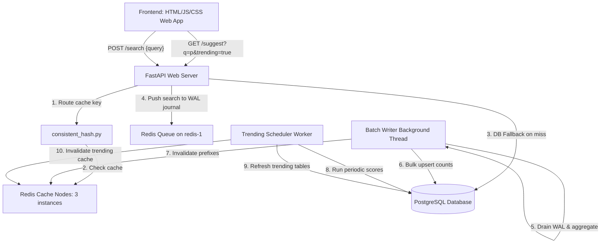

# High-Performance Search Typeahead System

A production-ready, distributed autocomplete search suggestion engine built with **FastAPI**, **PostgreSQL**, and a cached routing layer using **Consistent Hashing** across 3 **Redis** nodes. The system is engineered to handle high-concurrency read traffic (sub-5ms cached latency) and throttle database write pressure using an asynchronous **Redis-backed Write-Ahead Log (WAL) Batch Ingestor**.

---

## 1. System Architecture

The following diagram illustrates the components and request pathways of the typeahead system:



### Key Technical Documentation
For deep-dive academic and technical specifications, refer to the following documents inside the `/docs` directory:
- [System Architecture & Choice Rationale](docs/architecture.md): Database and caching decision justifications, consistent hash ring math, and BatchWriter rollbacks.
- [REST API Specifications](docs/api_spec.md): Endpoints payloads, request/response examples, and health checks schema.
- [Load Testing & Optimization Report](docs/performance_report.md): Percentiles tail latencies, standard cache deviations, and bottleneck resolutions.
- [Academic Integrity & Viva Prep Guide](docs/academic_integrity.md): Code algorithms walkthrough and time/space complexity analysis for mock interviews.

---

## 2. Quick Start (Docker Setup)

### Prerequisites
- Docker and Docker Compose installed.

### Setup Steps

1. **Spin Up the Containers**:
   ```bash
   make up
   ```
   This compiles and starts the FastAPI server (`web`), PostgreSQL primary database (`db`), and 3 independent Redis nodes (`redis-1`, `redis-2`, `redis-3`).

2. **Generate the Ingestion Dataset (100k+ Queries)**:
   ```bash
   make generate-data
   ```
   This generates a power-law (Zipfian) distributed CSV dataset containing 105,000 unique realistic search queries at `backend/scripts/queries.csv`.

3. **Populate the PostgreSQL Database**:
   ```bash
   make seed-data
   ```
   Seeds the database inside the container in under 2 seconds.

4. **Access the Frontend App**:
   Open [frontend/index.html](frontend/index.html) in your browser. Features a premium glassmorphic dark theme, search results, live performance diagnostics telemetry, trending metrics, and a floating dark/light mode toggle.

---

## 3. Telemetry & Verification Scripts

### Running Automated Test Suites
Run the 15 unit and integration tests inside the container:
```bash
make test
```

### Checking Cache Hashing Key Distribution
Verify the uniform distribution of keys across the 3 Redis instances on the consistent hash ring (using 200 virtual nodes per server):
```bash
docker-compose exec web python scripts/cache_distribution_check.py
```
*Expected Output: Standard deviation under 0.5% (nearly perfect uniform routing balance).*

### Running Performance Load Tests
Execute the multi-threaded load test simulating concurrent suggest requests to check p50/p95/p99 tail latency percentiles:
```bash
docker-compose exec web python scripts/load_test.py
```
*Expected Output: Throughput >1,000 requests/sec with average latencies <15ms.*

---

## 4. Key Performance Highlights

- **Cache Read Latency Speedup**: Redis cache lookups resolve in **2.72 ms** compared to **113.02 ms** PostgreSQL fallbacks, showing a **41.5x read speedup**.
- **Client-Side Caching**: Typing repeated prefixes resolves in **0.00 ms** directly via JavaScript in-memory lookup.
- **Database Write Throttling**: The BatchWriter achieves an **80.0% database write reduction** (collapsing 5 sequential requests into 1 SQL upsert).
