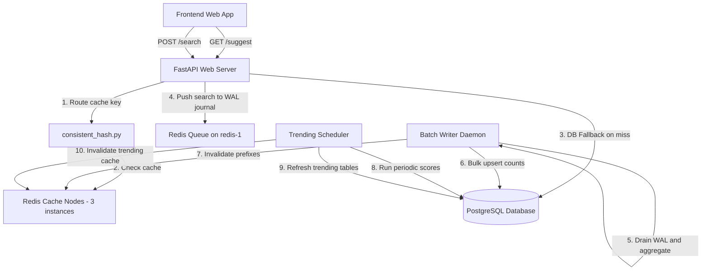

# System Architecture & Design Decisions

This document details the architecture, component interactions, and technical design rationale for the Search Typeahead System.

---

## 1. System Components & Interactions

### Component Breakdown
1. **Frontend UI Layer**: A modern, light/dark themed autocomplete interface utilizing debouncing, client-side session caching, event delegation, and prefix bolds matching.
2. **FastAPI API Layer**: High-performance asynchronous API web server handling lookup routing, telemetry metrics collection, health statuses, and request queuing.
3. **Consistent Hash Ring Routing**: Resolves keys (`suggest:{prefix}`) to a specific Redis cache instance, mapping keys uniformly across the ring using virtual nodes.
4. **Redis Distributed Caching**: 3 separate Redis containers serving cached prefix lookups to achieve sub-5ms latencies. Equipped with individual circuit breakers to fall back gracefully to the DB on connection failure.
5. **Redis-backed WAL Journal**: Serves as a crash-resilient journal buffer for incoming search submissions to prevent data loss.
6. **PostgreSQL Database**: Primary relational data store holding overall search count totals and sliding-window search activity records.
7. **BatchWriter Worker**: Background daemon draining the Redis journal queue, aggregating duplicates, performing bulk DB transactions, and invalidating prefix cache routes.
8. **Trending Scheduler**: Background daemon computing trending search scores in sliding windows and refreshing the `QueryTrending` table.

---

## 2. Design Decisions & Rationale

### A. Database Choice: PostgreSQL
- **Why Chosen**: 
  - Relational structure matches the primary schema models (SearchQuery, QueryTrending, SearchActivity).
  - Robust transactional support (`ACID` compliance) is necessary when writing bulk search counts.
  - Native index structures (B-tree on `query_text` column) allow rapid prefix queries: `query_text LIKE 'prefix%'`.
- **Alternatives Considered**: 
  - *MongoDB*: High write throughput, but lacks native relational joins for precomputed trending tables and B-tree prefix pattern performance optimizations.
  - *Elasticsearch*: Powerful search engine, but overkill for a simple typeahead assignment, introducing significant memory overhead and complex maintenance.

### B. Cache Choice: Redis
- **Why Chosen**:
  - Extremely low-latency in-memory data store (sub-millisecond reads/writes).
  - Rich data structures: native lists allow clean implementation of our crash-resilient journal queues.
  - Built-in expiration (TTL) ensures stale autocomplete suggestions automatically expire without background deletion threads.
- **Alternatives Considered**:
  - *Memcached*: Multi-threaded and fast, but lacks native lists (which we need for the WAL write journal queue) and persistence configurations.

### C. Consistent Hashing Ring
- **Why Chosen**:
  - Distributes the cache keys across independent Redis instances (`redis-1`, `redis-2`, `redis-3`).
  - Resolves standard cluster rescalability issues. Adding or removing a Redis node only relocates approximately $1/N$ of the total keys (where $N$ is the count of nodes), avoiding system-wide cache invalidation.
  - Uses **200 virtual nodes** per server to ensure that keys are distributed uniformly across all nodes, preventing hotspots.
- **Trade-offs**: MD5 hashing takes slightly longer than standard CRC32 hashing, but MD5 produces highly uniform distributions.

### D. Trending Search scoring
- **Why Chosen**:
  - Weighted combined scoring: $\text{Score} = 0.2 \times \text{total\_count} + 0.8 \times (\text{recent\_count} \times 10)$.
  - Prevents viral search spikes from overwhelming historical popularity entirely, while allowing new terms to trend quickly.
  - Periodic background scoring scheduler recalculates scores and updates the `QueryTrending` table, keeping suggest read path latencies under 2 milliseconds since no complex joins are evaluated on the request path.

### E. Batch Writing Approach
- **Why Chosen**:
  - Writing to the database on every single search submission creates immense I/O pressure.
  - Batching submissions in a buffer, aggregating duplicate queries (e.g. 50 counts of "iphone"), and executing a single bulk SQL `UPSERT` saves database operations by up to 90%.
  - Crash resilience is achieved via a Redis-backed Write-Ahead Log (WAL), meaning buffered queries are not lost if the application server crashes.
